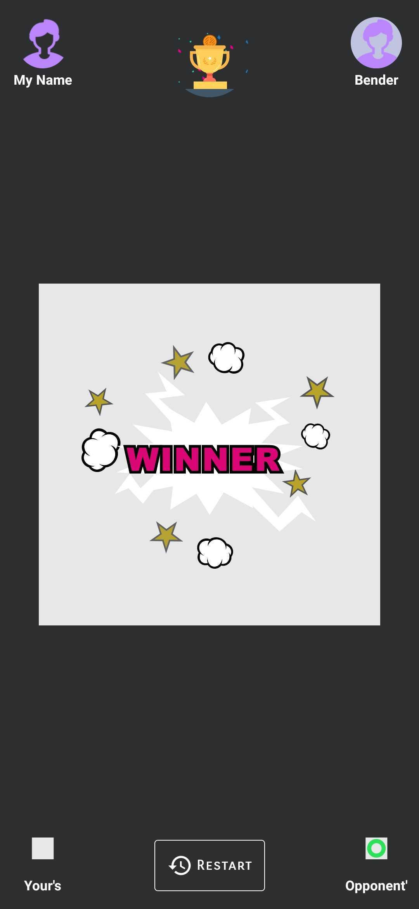

# Project-TADA🎉-MiniGames -- Under Development
MINI GAMES LIKE
1. Tic Tac Toe
2. Math Guess
3. Sudoku
4. Fish and Food - comming soon.

Tech Stacks Used
1.JetPack Navigations - SingleActivity
2.MVVM Architecture
3.Firebase, FCM.
4.Hilt
5.Dependencies Like - Lottie, Glide etc...

<H2>Here are some Screenshots </H2>
  

    
  

  

    
    
    
  

  

    
    
    
  

